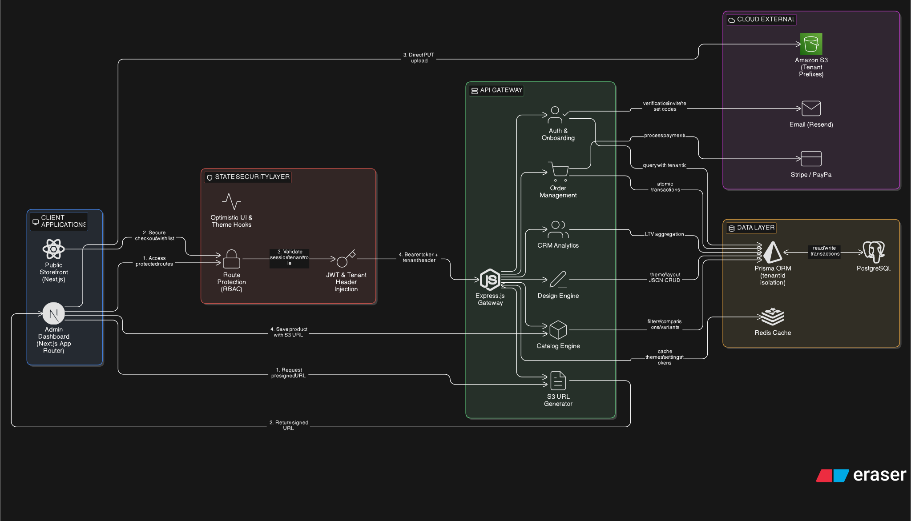

# MantraOne — Multi-Tenant B2B2C E-Commerce Platform

> **Note for Recruiters & Engineering Managers:** MantraOne is maintained in a private repository as proprietary, commercial SaaS software. This document serves as an architectural case study demonstrating system design, security implementations, and infrastructure decisions.


---

## Overview

MantraOne is a premium, multi-tenant B2B2C e-commerce SaaS platform built on a **"White-Glove" Agency Model**. A Super Admin provisions and manages tenant accounts (shop owners), each of whom receives an isolated Admin Dashboard to run their store. End-customers interact with a fully isolated, secure Storefront unique to each tenant.

---

## Architecture Diagram



*The diagram illustrates the separation of the Next.js Frontend layer, the Express.js API Gateway, and the PostgreSQL Data Layer, along with the AWS S3 direct-upload flow and multi-tenant data isolation boundaries.*

---

## Tech Stack

| Layer | Technology |
|---|---|
| Frontend | Next.js 14 (App Router), React, Tailwind CSS, Lucide React |
| Backend API | Node.js, Express.js (REST) |
| Database & ORM | PostgreSQL, Prisma ORM |
| Cloud Storage | AWS S3 (Presigned URL direct-upload) |
| Auth | JWT, Axios Interceptors, Custom `<AuthGuard>` |

---

## Core Architectural Implementations

### 1. Strict Multi-Tenancy & Data Isolation

Logical data isolation is the backbone of the platform. Every core model — `User`, `Category`, `Product`, `Customer`, `Order` — contains a `tenantId` foreign key. Every Prisma ORM query across the Express API enforces `where: { tenantId }` at the database level, making cross-tenant data leaks structurally impossible.

### 2. Zero-Trust Storefront Checkout

Client-side cart total calculations are a well-known attack surface. MantraOne's checkout API eliminates this by:

- **Ignoring all pricing data** sent from the frontend client
- Re-querying PostgreSQL for **real-time prices** on the backend
- Using a **`prisma.$transaction`** to atomically create the order, log the financial transaction, and decrement `stockQuantity` simultaneously — guaranteeing database integrity under concurrent load

### 3. AWS S3 Presigned URL Infrastructure

Routing large, multi-image product uploads through the Node.js server would block the event loop and degrade API performance across all tenants. The solution bypasses the server entirely:

1. The Next.js client requests a **Presigned URL** from the Express API
2. The client uploads `multipart/form-data` via a `PUT` request **directly to S3**
3. The Express server is never in the upload path

**Infrastructure challenge resolved:** Configured precise AWS S3 CORS policies (allowing `PUT`, `GET`, `POST`, `HEAD`, `DELETE`) and scoped IAM inline policies (`s3:PutObject` mapped strictly to `arn:aws:s3:::mantraone/*`) to overcome browser security restrictions.

### 4. White-Glove Auth & Route Protection

Public registration is completely disabled. The onboarding flow:

- Provisions accounts via **secure email activation links** using a one-time `activationToken`
- Ensures the system never stores or transmits temporary plain-text passwords
- Protects all frontend routes with a custom Next.js **`<AuthGuard>`** component
- Uses global **Axios JWT interceptors** to handle token injection and `401 Unauthorized` refresh/redirect flows

**Engineering fix:** Resolved an auth infinite-loop race condition caused by async token validation racing against the React render cycle by implementing strict `try/catch/finally` blocks to explicitly release `isLoading` state, combined with corrected Next.js Route Group caching.

---

## CRM & Data Engineering

**Dynamic Aggregation:** The backend CRM engine uses Prisma `_sum` and `_count` aggregations to calculate *Customer Lifetime Value (LTV)*, *revenue metrics*, and *Last Order Date* dynamically on the server — eliminating the need to return raw order arrays to the client.

**Advanced Frontend State:** Data tables feature debounced search, status-tab filtering with automatic pagination reset, and **optimistic UI updates** — deleted rows are removed from the UI instantly without a hard page reload.

---

## Project Roadmap

```
Phase 1 — ✅ Complete
  ├── Multi-tenant database engine & schema
  ├── Auth flows (activation, JWT, route guards)
  ├── Admin catalog CRUD
  └── AWS S3 presigned upload infrastructure

Phase 2 — 🚧 In Progress
  ├── Visual dashboard analytics (revenue & order charts)
  └── Dynamic public Storefront UI for end-customers
```

---

## Engineering Challenges & Resolutions

| Challenge | Root Cause | Resolution |
|---|---|---|
| Server bottleneck on image uploads | Multipart uploads blocking the Node.js event loop | Presigned URL flow; uploads go directly to S3, bypassing the API server |
| Client-side price tampering risk | Cart totals calculated on the frontend | Zero-Trust checkout API; backend re-queries all prices and ignores client payload |
| Auth infinite loop on login redirect | Async token validation racing against React render cycle | `try/catch/finally` to explicitly release loading state + corrected Route Group caching |

---

*Architected and developed by [Tishanth Sivakumar] · [LinkedIn](https://www.linkedin.com/in/tishanth-t007/)*
